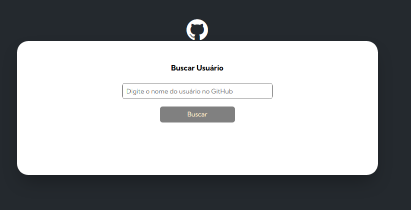
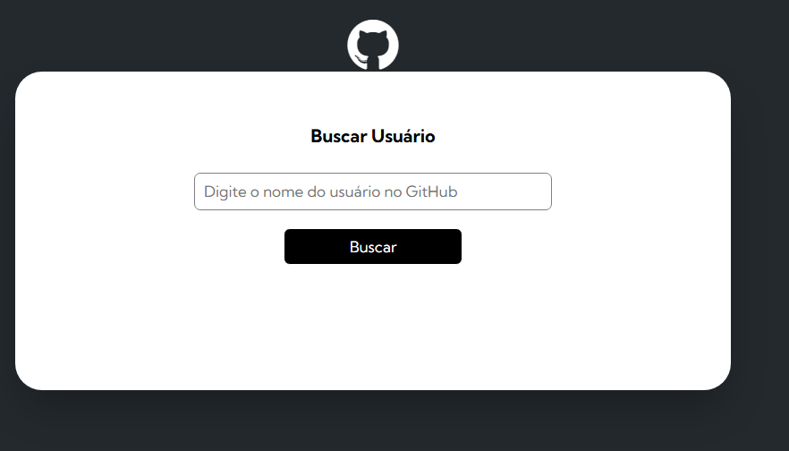
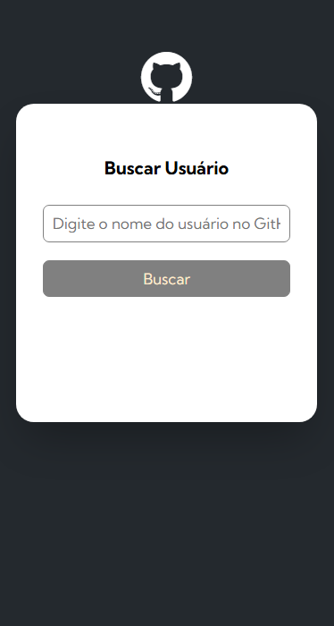
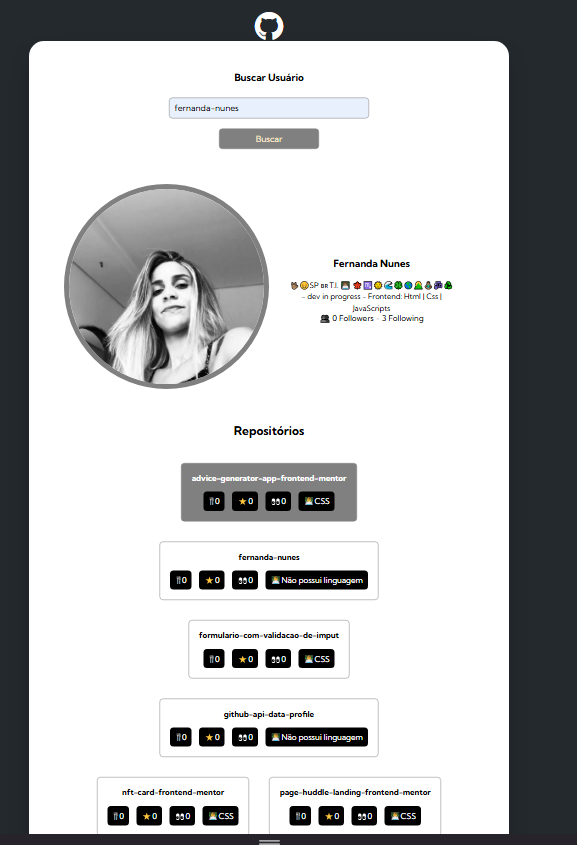

# GitHub API - Data Profile

<b>Este projeto é o resultado de um desafio do módulo de JavaScript avançado proposto pelo curso DevQuest.</b>

## Visão Geral 

###  Projeto 

<b> O objetivo é desenvolver uma página de busca que apresenta na tela o dados do perfil de usuário do site GitHub. 

###  Desafio

<b>O desafio é desenvolver uma página de busca de perfil de usuários do site GitHub, partir dos designs e funcionalidades fornecidas. Que ao clicar no botão "Buscar" ou na tecla "Enter", o sistema faz uma busca utilizando a API do GitHub.

### Funcionalidades 
<ul>
<li>Ao digitar o usuário e clicar no botão "Buscar" ou na tecla "Enter", o sistema faz uma busca utilizando a API do GitHub e mostra na tela dados do perfil do usuário.
<li>Os dados do perfil do usuário será apresentado em duas sessões:   
 A primeira é de Informações com Foto, Nome, bio, seguidores e quem está seguindo:   
 
   
 E a segunda com os Repositórios e a lista de seus elementos: 🍴forks, ⭐stars,  👀watchings e a 👨🏿‍💻linguagem utilizada:</li>
  
 
</ul>

### Capturas de tela 

Preview:  
  
  
     
Preview - mobile:  
  
    

Preview da busca:   
  
  
    
### Links 
<ul>
<li><a href="https://github.com/fernanda-nunes/github-api-data-profile" target="_blank"> Repositórios</a></li>
<li><a href="https://fernanda-nunes.github.io/github-api-data-profile/" target="_blank"> Site ao vivo</a></li>
</ul>

## O que eu aprendi 

<b> Durante o desenvolvimento deste projeto, tive a oportunidade de consolidar e expandir minhas habilidades em desenvolvimento front-end e manipulação de API.
